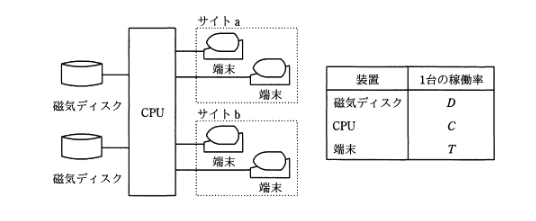
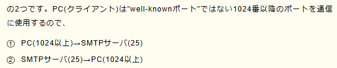
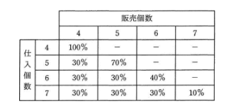

# 実績

- 模擬試験を 60 問で実施。
- 正答率は 81%
  - 過去に解いた問題が多く出た印象があるが、本当に理解して解いているかといわれると自信がない部分もある。
  - 間違えた分野は、相関係数の問題
    - これは昨日も出題されまた間違えてしまった。
  - 以下の磁気ディスクはなぜ直列なのか理解できないので復習が必要。
    
  - メモリリークが理解できないので復習が必要。
    - メモリが解放されないことで覚えたらいいのでしょうか。
    - こういった覚え方だから、応用が効かないのかもしれない。
  - ニモニックコードは値からデータの内容を連想できるようにする方法らしい。
  - 割れ窓理論は、犯罪が放置されると更に犯罪が増えるという理論らしい。
  - SQL インジェクションの選択肢で、プレースホルダを使って命令文を組み立てるというのがあったが、意味が分からないので復習が必要。
  - 以下は、だいぶ前に解いたが間違えてしまった
    
  - IDS は、不正侵入検知システムのことらしい。通知という文言が出てきたら怪しい。
    - 覚え方が雑なので、復習が必要。
  - アカウントアグリゲーションとは、複数の金融機関の口座情報を一元管理する仕組みらしい。
  - 以下の問題は最後まで計算していたら解けていた。途中でめんどくさくなって選択肢を適当に選んでしまった。
    
  - クラスタ分析法の覚え方は、集合とか分類で覚えていたのに、解けなかった。
