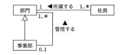

# 実績

- 模擬試験 40 問
- 正答率 87%

# 振り返り

- テストカバレッジ分析がなにか理解できていなかったため、復習が必要。
  - いったんコードの中のどれだけ実行できたかを測るみたいな感じで覚えておく。
- UML があまり理解できていなかった。
  - クラス図、シーケンス図、アクティビティ図など、各種 UML 図の役割を復習する。  
    
- またサブネットマスクの問題を間違えてしまった。
  - 今回の解き方はなんとなく理解したが、根本的になんでそのように解くのか理解できていない。
- arp コマンド（何回も間違えている気がする）ipconfig 選びがち。
  - 同じネットワーク内の IP アドレスと MAC アドレスの対応表を表示・操作するコマンドらしい。

# 実は科目 B も少し解いた

- 令和 6 年度サンプル問題
- 6 問程度
- 因みに全問正解

## 感想

- 実務でマクロや Python などでロジックを組むことがあるので、時間があれば解ける気がする。
